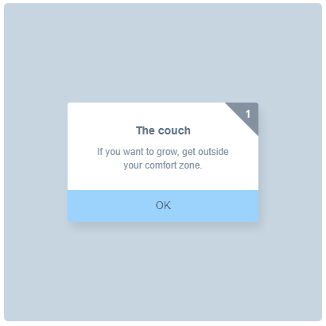

# CSSChallengeEffects
Repository for recording my 100 Days CSS effects in different ways.

100 Days CSS Website: https://100dayscss.com/

## Display

### Day1-10

### Day11-20

### Day21-30

#### Day26

#### Day27

#### Day28

### Day31-40

#### Day31

#### Day32

#### Day33

#### Day34

#### Day35

#### Day36

#### Day37

#### Day38

#### Day39

#### Day40
